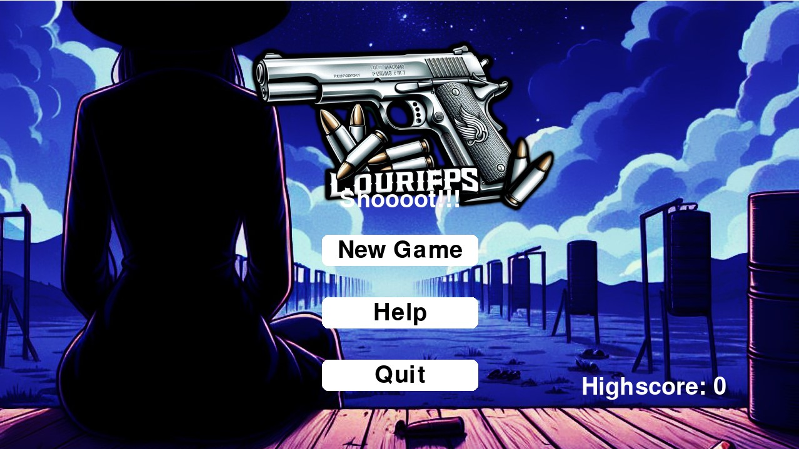
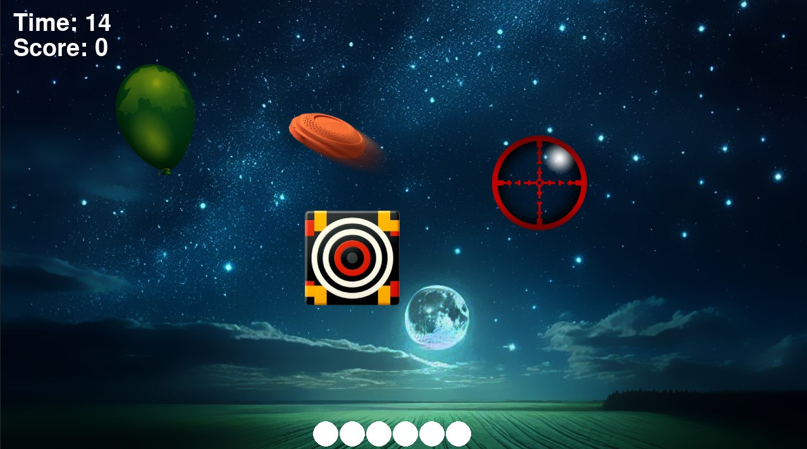
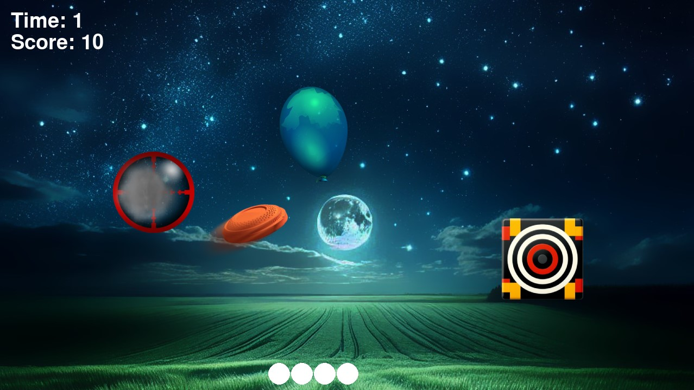

# 🎯 LouriFPS - A Pygame-based FPS Game

## :video_game: A simple First-Person Shooter game built with Pygame.

### 🛠️ Technologies Used
- **Pygame 2.x**
- **Python 3.x**

## Screenshots :camera_flash:

### 1. Main Menu

### 2. In-Game Action

### 3. Scoring System

### 🎮 How to Play
1. **Clone the repository**
2. **Install Pygame** using `pip install pygame`
3. **Run the game** using `python main.py`

### 🤝 Contributing
We welcome contributions to improve and expand the game! If you'd like to help, please fork the repository and submit a pull request.

### 🚀 Future Development Ideas
- Implement **2-player mode** with keyboard and mouse controls
- Break down the code into smaller files for better maintainability and scalability
- Add more **stages and challenges**
- Incorporate additional **animations and effects**
- Improve game **performance and optimization**

### 📋 Current Features
- **Basic FPS gameplay** with scoring system
- **Particle system** for simple effects
- **Randomized target positions and colors**

### 🛣️ Roadmap
- Improve game **performance and optimization**
- Add more **features and challenges**
- Enhance the user experience with better **graphics and sound effects**

### 💬 Get Involved!
If you're interested in contributing to the project, please don't hesitate! 😊
